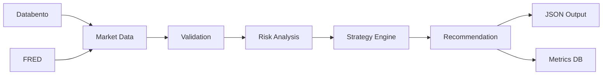

# AGENTS.md - Agent Instructions for Unity Wheel Trading

## 📑 Table of Contents

- [Project Overview](#project-overview)
- [Allowed/Disallowed Actions](#-disallowed-actions)
- [Agent Reasoning Checklist](#-agent-reasoning-checklist)
- [Architecture Overview](#-architecture-overview)
- [Agent Guidelines](#agent-guidelines)
- [Real-World Examples](#-real-world-examples)
- [Dependency Matrix](#-dependency-matrix)
- [Known Issues](#known-issues--solutions)
- [Quick Commands](#quick-commands)
- [Environment Variables](#environment-variables)
- [Troubleshooting](#troubleshooting)
- [Legal & Compliance](#️-legal--compliance)

## Project Overview
Unity Wheel Trading Bot v2.2 - Options wheel strategy recommendation system with autonomous operation and enterprise-grade reliability.

## 🚫 Disallowed Actions

| Category | Details | Why |
|----------|---------|-----|
| **Trade Execution** | Never call broker order endpoints | Recommendations only - legal/compliance |
| **Synthetic Data** | No Black-Scholes generated prices, mock volume | Real data only policy |
| **Direct DB Writes** | No manual SQL to metrics.db | Use proper APIs only |
| **Credential Storage** | No hardcoded secrets in code | Use env vars or Google Secrets |
| **Unsafe Imports** | pandas_ta, mpl_finance, C-compiled packages | Container compatibility |

## ✅ Allowed Actions

| Category | Details | Example |
|----------|---------|---------|
| **Recommendations** | Generate JSON trade suggestions | `{"action": "SELL_PUT", "strike": 35}` |
| **Mock Mode** | USE_MOCK_DATA=true for testing | Safe container testing |
| **Read Operations** | Query Databento chains | All GET endpoints |
| **Risk Calculations** | VaR, Greeks, portfolio analytics | All math operations |
| **Logging & Metrics** | Track decisions and performance | Via proper APIs |

## 📊 Current Market Conditions (Unity - June 2025)

### Volatility Environment
- **Current**: 87% (extreme high)
- **6-Month Range**: 44-131%
- **Regime Distribution**: 15% of days >100% vol

### Optimized Parameters (from backtests)
- **Target Delta**: 0.40 (higher due to extreme vol)
- **Target DTE**: 30 days (shorter for vol capture)
- **Expected Return**: 27-30% annually
- **Win Rate**: 100% (when avoiding earnings)

### Critical Risk Factors
- **Gap Events**: 38 per year (>10% moves)
- **Earnings Moves**: ±15-25% typical
- **Assignment Risk**: Low with proper management
- **Earnings Avoidance**: MANDATORY

## 🔄 Agent Reasoning Checklist

When generating wheel recommendations:
1. Check market hours (`is_trading_day()`)
2. Validate environment (`src.unity_wheel.utils.validate`)
3. Fetch option chain from Databento
4. Filter strikes by liquidity (volume > 100)
5. Calculate Greeks for viable strikes
6. Apply adaptive sizing rules
7. Check risk limits (position size, volatility)
8. Return top 3 candidates with confidence scores
9. Log decision to metrics.db

## 📊 Architecture Overview



Data Flow: Market Data → Validation → Risk Analysis → Strategy → Recommendation

## 💡 Real-World Examples

```bash
# Standard recommendation (Unity at 87% volatility)
python run.py -p 100000

# High volatility scenario (Unity often >100%)
python run.py -p 100000 --override-vol-check

# Earnings week handling (CRITICAL for Unity - ±15-25% moves)
python run.py -p 100000 --days-to-earnings 3

# Debug specific strike selection
python run.py -p 100000 --debug-strikes --ticker U

# Container-safe dry run
USE_MOCK_DATA=true python run.py -p 100000 --dry-run

# Test with optimized parameters from backtests
python run.py -p 100000 --delta 0.40 --dte 30

# Full diagnostics with performance profiling
python run.py --diagnose --profile

# Test with specific volatility regime
python run.py -p 100000 --test-vol 0.87  # Current Unity vol

# Validate specific strike recommendation
python -c "from src.unity_wheel.strategy.wheel import validate_strike; print(validate_strike(35.0, 40.0, 0.40))"

# Check gap event risk (Unity has 38/year)
python -c "from src.unity_wheel.risk.analytics import calculate_gap_risk; print(calculate_gap_risk('U', threshold=0.10))"
```

## 📦 Dependency Matrix

| Python | NumPy | Pandas | Pydantic | Status |
|--------|-------|--------|----------|--------|
| 3.8    | 1.19+ | 1.1+   | 1.10+    | ✅ Supported |
| 3.9    | 1.19+ | 1.2+   | 1.10+    | ✅ Supported |
| 3.10   | 1.21+ | 1.3+   | 2.0+     | ✅ Supported |
| 3.11   | 1.23+ | 1.5+   | 2.0+     | ✅ Recommended |
| 3.12   | 1.26+ | 2.0+   | 2.5+     | ⚠️ Experimental |

**Container Mode**: Falls back to pure Python implementations if packages unavailable

## Agent Guidelines

### 🔧 Setup & Environment
```bash
# Quick container setup
./container_setup.sh

# Activate environment
source .codex/activate_container.sh

# Run diagnostics
./.codex/container_test.sh
```

### 📦 Package Management
- **Enhanced Mode**: numpy + pandas + pydantic installed
- **Pure Python Mode**: Fallback implementations (container-safe)
- **Auto-detection**: Script determines best mode for environment

### 🐍 Python Compatibility
- **Supports**: Python 3.8 - 3.12
- **Auto-selects**: Best available version (prefers 3.11+)
- **Fallback**: Uses any compatible version found

### 🧪 Testing Strategy
```bash
# Only run if dependencies available
if [ "$NUMPY_AVAILABLE" = true ]; then
    pytest tests/test_math_simple.py -v
else
    echo "Using pure Python mode - some tests skipped"
fi
```

## Known Issues & Solutions

### Issue 1: File System Artifacts
**Problem**: 20+ duplicate files with " 2" suffix (macOS/iCloud sync issues)
**Impact**: Confusion, potential import errors, cluttered structure
**Solution**:
```bash
# Clean all duplicate files
find . -name "* 2.*" -type f -delete
# Remove redundant directories
rm -rf ml_engine/ risk_engine/ strategy_engine/
# Remove nested duplicate
rm -rf Documents/com~apple~CloudDocs/
```

### Issue 2: Mixed Async/Sync Patterns
**Problem**: Some modules async (databento), others sync (calculations)
**Impact**: Complex error handling, harder testing
**Solution**: Define clear async boundaries at data provider level

### Issue 3: Lazy Import Overuse
**Problem**: Lazy imports scattered throughout codebase
**Impact**: Runtime overhead, poor IDE support
**Solution**: Replace with proper dependency injection pattern

### Issue 4: Configuration Access
**Problem**: Config loaded in multiple places
**Impact**: Hard to mock for testing, inconsistent behavior
**Solution**: Create centralized ConfigurationService

### Issue 5: Python Version Compatibility
**Problem**: pyproject.toml may require Python ^3.12
**Solution**: Verify supports `python = "^3.8"` for broader compatibility

## Agent Capabilities

### 🎯 Core Functions
- Options pricing with Black-Scholes + Greeks
- Risk analytics with VaR/CVaR calculations
- Wheel strategy optimization
- Portfolio position sizing

### 📊 Data Sources
- **Databento**: Options chains, market data
- **FRED**: Risk-free rates, economic data

### 🛡️ Safety Features
- Confidence scoring on all calculations
- Circuit breakers for extreme conditions
- Comprehensive logging and monitoring
- Mock data mode for safe testing

## Quick Commands

### Development
```bash
# Get recommendation
python run.py -p 100000

# Run diagnostics
python run.py --diagnose

# Quick health check
./scripts/housekeeping.sh -q

# Test specific function
python -c "from src.unity_wheel.math.options import black_scholes_price_validated as bs; print(bs(100,100,1,0.05,0.2,'call'))"
```

### Container Operations
```bash
# Setup fresh environment
./.codex/container_setup.sh

# Run tests with proper environment
./.codex/container_test.sh

# Quick commit
./.codex/container_commit.sh "commit message"  # stages and commits all changes
```

## Environment Variables

### Required for Live Mode
```bash
DATABENTO_API_KEY=xxx
```

### Container/Development Mode
```bash
USE_MOCK_DATA=true
OFFLINE_MODE=true
DATABENTO_SKIP_VALIDATION=true
USE_PURE_PYTHON=true  # or false if packages available
CONTAINER_MODE=true
```

## File Structure Priority
```
src/unity_wheel/          # Primary codebase - USE THIS
├── api/advisor.py         # Main recommendation logic
├── math/options.py        # Options calculations
├── risk/analytics.py      # Risk management
└── strategy/wheel.py      # Wheel strategy

unity_trading/             # DUPLICATE - SHOULD BE REMOVED
```

## Agent Best Practices

1. **Always check environment**: Source `.codex/.env` first
2. **Verify dependencies**: Check numpy availability before math operations
3. **Use fallbacks**: Pure Python mode works in all environments
4. **Test incrementally**: Run quick tests before full test suite
5. **Container-first**: Assume restricted environment unless proven otherwise

## Troubleshooting

### Import Errors
```python
# ❌ Wrong
from unity_trading.math.options import black_scholes

# ✅ Correct
from src.unity_wheel.math.options import black_scholes_price_validated
```

### Missing Dependencies
```bash
# Check what's available
python -c "import numpy; print('numpy OK')" 2>/dev/null || echo "numpy missing"

# Install if possible
python -m pip install --user numpy pandas pydantic
```

### Container Issues
```bash
# Reset environment
rm -rf .codex/.env
./.codex/container_setup.sh

# Check container type
echo "Container: $CONTAINER_TYPE"
echo "Strategy: $INSTALL_STRATEGY"
```

## ⚖️ Legal & Compliance

**FINANCIAL DISCLAIMER**: This software is for educational purposes only. Not financial advice. No warranties implied. Past performance does not guarantee future results. Options trading involves substantial risk of loss.

**DATA USAGE**: All market data must come from licensed providers (Databento). No web scraping or unauthorized data sources.

**COMPLIANCE NOTES**:
- Never executes trades (recommendations only)
- No synthetic/mock market data in production
- All credentials stored securely (env vars or Google Secrets)
- Audit trail maintained in metrics.db

---

**Generated for Claude Code / Codex optimization**
**Last updated**: 2025-06-10
